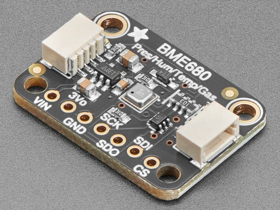

# LoRaWan_MLX90614_BME680_Merge
Welcome to the NextGen Environmental Sensor Lab. This project uses the capabilites of two varying temperature sensors to sample the nearby environment for analysis. The BME 680 temp. humidity. pressure sensor and the non-contact infared MLX90614 temperature sensor sample the area. Their readings are then sent to an online broker through the use of LoRaWAN technology. Where they are sent to a database or spreadsheet for analysis.  

Below is a general walkthrough to utilize these sensors in the matter stated above. 

## Content
### Arduino
* Required Libraries and Boards
* Code Contents
### Sensor BOM 
* Parts List

## Arduino IDE
To use the code in the [Arduino](https://github.com/NextGen-Environmental-Sensor-Lab/LoRaWan_MLX90614_BME680/tree/main/Arduino) folder the user needs to install the following libraries:
* LoRaWan_APP.h
* Arduino.h
* Adafruit_Sensor.h
* Adafruit_BME680.h
* Adafruit_MLX90614.h
* Wire.h

and the CubeCell Development Framework (by Heltec Automation(TM)) board manager.
Once installed the code can be used. 

Note: The board used from this board manager is the "CubeCell-Board Plus (HTCC_AB02)".

Also Note: Our code is a modified version of the Adafruit BME680 and MLX90614 examples in conjunction with LoRaWAN. 

### Code Contents: 
* Identification to connect to the online broker
* Data sampling and transcieving to the broker
* Sleep cycle to conserve power

### Parts List

| Part Name | Part Image | Purchase Link|
|----------|--------|:-----------------------:|
|BME 680|  |[Adafruit](https://www.adafruit.com/product/5046)
|CubeCellCubeCell Dev-Board Plus (HTCC-AB02)|  |[Heltec Automation](https://heltec.org/project/htcc-ab02/)
|MLX90614-DCI|  |[DFRobot](https://www.dfrobot.com/product-1745.html)
